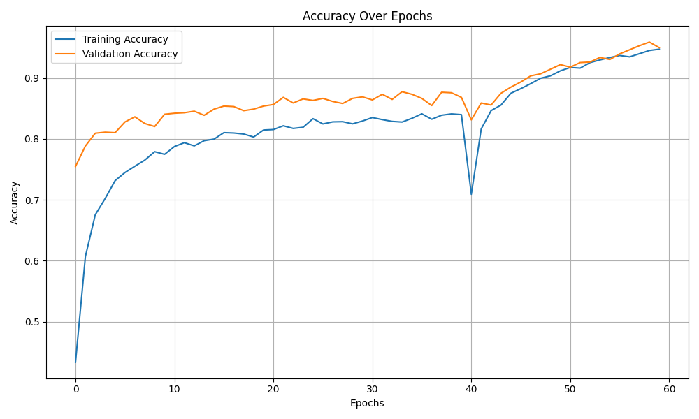
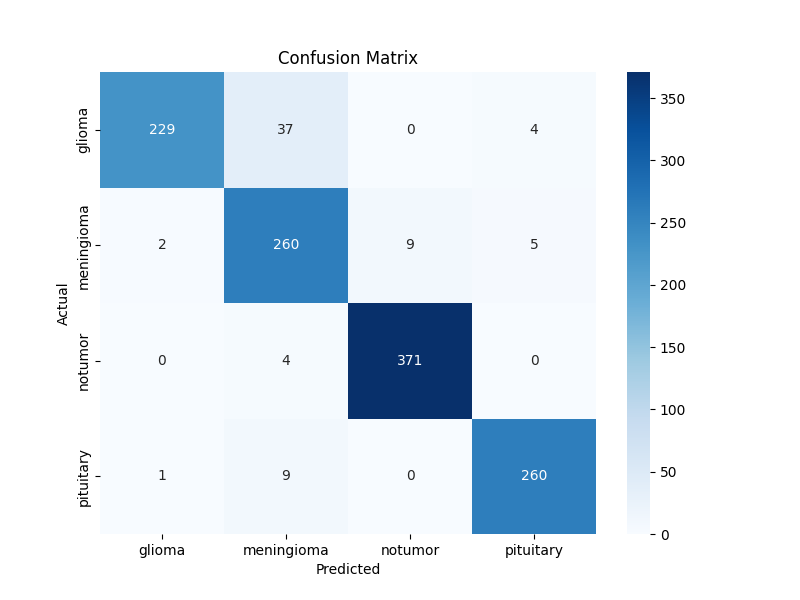
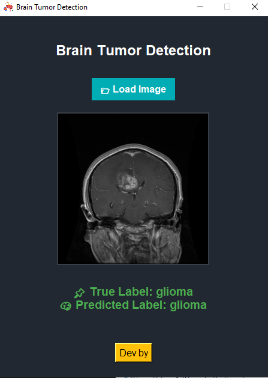

# 🧠 Brain Tumor Detection System (Desktop AI Assistant)

A professional desktop application that leverages deep learning to classify brain MRI images and detect tumors with high accuracy. Built using **TensorFlow** and **Tkinter**, the app offers an intuitive and fast experience for non-commercial use.

> 📖 **License**: This project is licensed under the [MIT License](#-license).

---

## 💡 Overview

This system automatically analyzes brain MRI scans and classifies them into four categories:

- **Glioma Tumor**
- **Meningioma Tumor**
- **Pituitary Tumor**
- **No Tumor**

The goal is to support medical professionals and researchers with a fast, offline AI-based tool.

---

## 🎯 Model Performance

| Metric            | Value (%)   |
|-------------------|-------------|
| **Training Accuracy** | 94.72      |
| **Testing Accuracy**  | 93.87      |


The model shows a high level of generalization and consistent performance on unseen data.

---

## 📈 Accuracy Curve



This graph shows training and validation accuracy across epochs.

---

## 📊 Confusion Matrix



The confusion matrix shows how well the model distinguishes between tumor types.

---

## 🖥️ Application UI



- Drag and drop or browse to load MRI images
- AI prediction with class and real class  
- Clean, minimal, and modern design (Tkinter)

---

## 🗂️ Project Structure

```
BrainTumorDetection/
│
├── Test/
│   ├── glioma
│   ├── meningioma
│   ├── notumor
│   ├── pituitary
│   ├── model/
│   ├── brain_tumor.keras # Trained Keras model

├── assets/                     # Images for documentation (UI, graphs, etc.)
│   ├── app_interface.png
│   ├── accuracy_curve.png
│   └── confusion_matrix.png
│
├── main.py    # Main application (GUI + prediction)
├── LICENSE                     # MIT License file
└── README.md                   # Project documentation
```

---

## 🧪 Tech Stack

- **Language**: Python 3.x
- **Deep Learning**: TensorFlow & Keras
- **GUI**: Tkinter
- **Image Processing**: PIL, NumPy
- **Input Size**: 224x224 RGB

---

## 📄 License

This project is licensed under the **MIT License**.

```
MIT License

Copyright (c) 2025

Permission is hereby granted, free of charge, to any person obtaining a copy
of this software and associated documentation files (the “Software”), to deal
in the Software without restriction...
```

Read the full license in the [LICENSE](LICENSE) file.

---

## ⚠️ Disclaimer

> This application is intended **for research and educational purposes only**. It is not certified for clinical use. Please consult a medical professional for any health concerns.

---

## 👤 Author

**HoussemBouagal**  
📧 Email: mouhamedhoussem813@gmail.com 

🔗 LinkedIn: [[LinkedIn]](https://www.linkedin.com/in/houssem-eddine-bouagal-98025a297)  

🌐 Portfolio:[[Portfolio]](https://houssembouagal.github.io/Portfolio/)
